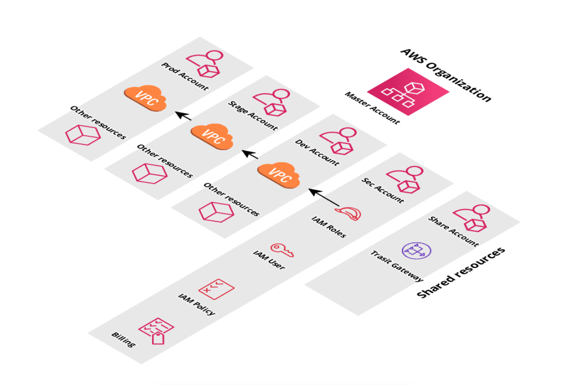

# A simple diagram about the solution:



# Prerequisites to run example Infrastructure 
* Create a S3 Bucket, for the Terraform state files *(example name: example-app-tfstate)*
* [Install](https://learn.hashicorp.com/tutorials/terraform/install-cli) terraform in the machines that will execute.
* [Install](https://terragrunt.gruntwork.io/docs/getting-started/install/) terragrunt in the machines that will execute.
* [Install](https://docs.aws.amazon.com/cli/latest/userguide/getting-started-install.html) AWS CLI in the machines that will execute.
* To have or create a IAM user with admin permissions to create and manage the AWS resources.
* Use a key encrypt software, like GPG keychain. [Ref](https://gpgtools.org/)

# How to create example Infrastructure
## AWS example variables and parameters
Since the development of the TF templates and all of the infrastructure was done on a example AWS account, information like vpc id, subnets, ip’s... is specific for our
environment.

1. With your IAM programmatically credentials, login to  AWS CLI running:
```shell
aws configure
 ```
2. Go to the directory:
```shell
 cd /infra-organization/master
 ```
3. Run the init.sh script:
```shell
 ./init.sh -a terraform_init_access_key -s terraform_init_secret_key -k keybase_profile
 ```
